- [CICDフロー説明](#cicdフロー説明)
  - [GitHub Actions](#github-actions)
    - [アプリケーションソース](#アプリケーションソース)
  - [CloudWatch](#cloudwatch)
    - [ECRの変更検知](#ecrの変更検知)
  - [CodeStarConnections](#CodeStarConnections)
  - [CodePipeline](#codepipeline)
    - [Sourceステージ](#sourceステージ)
    - [Deployステージ](#deployステージ)

# CICDフロー説明

本レポジトリで構成するCICDについて解説します。全体の流れは以下の通りです。
大きく、GitHub Actionsでソースを準備するいわゆる`CI`の部分、
CloudWatchおよびCodeStarConnectionsで変更を検出する部分、
CodePipelineでデプロイするいわゆる`CD`の部分に分かれます。

##  GitHub Actions

アプリケーションおよびECSのデプロイ設定はそれぞれGitHubのレポジトリで管理しています。
アプリケーションレポジトリに変更がプッシュされるとGitHub Actionsにより変更内容がAWSのソース置き場（ECR）に配置されます。

### アプリケーションソース

アプリケーションのレポジトリの`masterブランチに変更がプッシュ`されるとGitHub Actionsによりアプリケーションビルドのパイプラインが自動実行されます。サンプルレポジトリの場合は以下のようなパイプラインを定義しています。パイプラインの設定内容はレポジトリの`.github\workflows\workflow.yml`を参照ください。

- GitHub Actionsセルフホストランナー上で docker コマンドを使用してレポジトリのルートにあるdockerfileをbuildする
- buildしたimageは以下のタグを付与しECRにプッシュする
  - `<ECRホスト名>/<PJ-NAME-APP-NAME>:latest`
- このパイプラインは`master`ブランチに対する変更時に実行する
- パイプラインは`latest`のタグがついたrunnerで実行する

ECRにプッシュされる最新のイメージは常に`<ECRホスト名>/<PJ-NAME-APP-NAME>:latest`というイメージ名になります。古いイメージは`タグなし`となり一日経過後にライフサイクルポリシーにより自動で削除されます。もし、古いイメージに戻したい場合はアプリケーションレポジトリを過去のバージョンに戻してイメージを再ビルドしてください。

## CloudWatch

ソース置き場（ECR）が更新されるとその変更を検知し、CloudWatchからCodePipelineが実行されます。

### ECRの変更検知

ECRの変更はCloudWatch Eventで検知します。指定したレポジトリに対するイメージプッシュが成功したイベントを検知するとCodePipelineのパイプラインを開始します。

## CodeStarConnections

アプリケーションおよびECSのデプロイ設定はそれぞれGitHubのレポジトリで管理しています。
ECSデプロイ設定のレポジトリに対し`masterブランチに変更がプッシュ`されるとCodeStarConnectionsによりレポジトリの更新が検知され、
これによりCodePipline が実行されます。

## CodePipeline

CodePipelineは2つのステージで構成します。`Source`ステージと`Deploy`ステージです。これらのステージは順番に実行されます。`Source`ステージはデプロイに必要な情報を取得するステージです。`Deploy`はCodeDeployを実行し、ECSサービスのタスクをBlue/Greenデプロイで更新します。

### Sourceステージ

Sourceステージは2つのソースアクションを定義しています。GitHub(ECSレポジトリ)およびECRから情報を取得するアクションです。それぞれ以下の情報を取得し、アーティファクトとして格納します。格納したアーティファクトは次のステージへ引き継がれます。

- CodeStarConnections
  - ECSデプロイ設定をGitHubのレポジトリから取得し、`settings.zip`を作成します。
  - 作成したzipを`settings`という名前のアーティファクトとして格納します。
- ECR
  - 指定レポジトリの`latest`タグのついたイメージ名（このイメージは<アカウントID>.dkr.ecr.<リージョン>.amazonaws.com/<レポジトリ名>@<イメージのハッシュID>の形式となる。そのため、同じlatestタグでもイメージを一意に判別できる）を取得します。
  - 上記取得したイメージ名を`images`という名前のアーティファクトとして格納します。

### Deployステージ

Deployステージは1つのデプロイアクションを定義しています。CodeDeployを使用したECSサービスのタスクをBlue/Greenデプロイするアクションです。前のステージで取得したアーティファクトを使い、Blue/Greenデプロイ用に定義したCodeDeployを実行します。

- アーティファクト`settings`および`images`を受け取ります
- `settings`のzipを展開し、中に含まれる`appspec.yaml`を`AppSpecTemplatePath`に設定します
- `settings`のzipを展開し、中に含まれる`taskdef.json`を`TaskDefinitionTemplatePath`に設定します
- アーティファクト`images`に格納されたイメージを使用し、`taskdef.json`内の`IMAGE1_NAME`を置換します
  
CodeDeployによるタスクの切り替えには数分時間を要します。パイプラインの進行状況はマネジメントコンソールのCodePipelineまたはCodeDeployで確認できます。

デプロイが成功しても不具合などが見つかりすぐに前のバージョンへ戻したい場合はCodeDeployからロールバックを実行してください。Blue/Greenの設定で5分間、前バージョンのタスクを削除する猶予期間を設けています。この猶予期間はサービスデプロイモジュールのパラメータで任意の時間に設定可能です。

ただし、アプリケーション（ECR）の変更に伴うデプロイをした後のBlue/Greenのロールバックをした場合は注意が必要です。Blue/Greenのロールバックを実行してもECRのイメージはロールバックされません。そのため、ECRにあるlatestタグのイメージは更新され、前バージョンのイメージはタグなしのイメージとなります。ECRのライフサイクルポリシーでタグなしのイメージは1日後に自動で削除するようになっているため、1日以上放っておくと稼働中のイメージが消失してしまいます。タスク異常終了やレプリカ数の増大など、新たにタスクを作るまでは問題になりませんが、忘れない内にアプリケーションを正しく修正し、ECRのイメージを最新化しましょう。

ECS定義のみの更新であれば上記影響ありません。CodeDeployからロールバックを実行するとタスク定義は残りますが、サービスが使用するタスク定義はロールバックされ、前バージョンのタスク定義を使用します。

