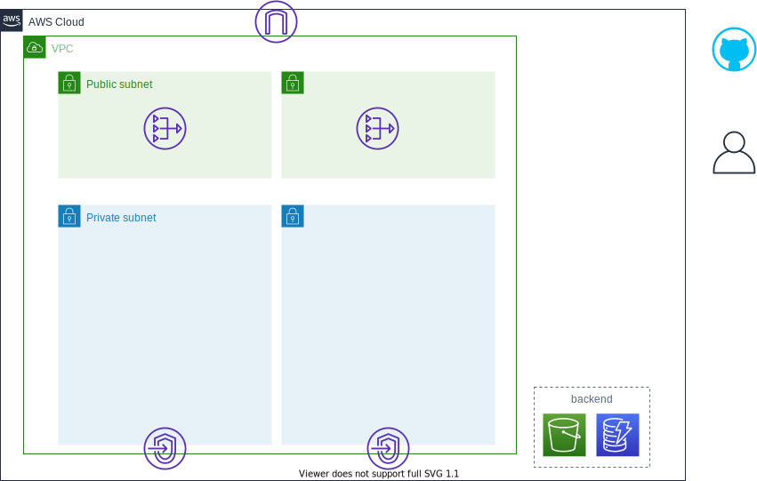

<!-- TOC -->

- [使い方](#使い方)
    - [前提条件](#前提条件)
        - [AWS CLIの導入](#aws-cliの導入)
        - [GitHubのOrganization 作成](#githubのorganization-作成)
    - [環境構築](#環境構築)
        - [tfバックエンド](#tfバックエンド)
        - [ネットワーク](#ネットワーク)
        - [GitHub環境の事前準備](#github環境の事前準備)
        - [GitHub Actionsセルフホストランナー](#github-actionsセルフホストランナー)
        - [ECSクラスタ](#ecsクラスタ)
    - [サービス構築](#サービス構築)
        - [事前準備](#事前準備)
        - [GitHub Actionsによるソース配置](#github-actionsによるソース配置)
        - [AWS-GitHub間の連携](#aws-github間の連携)
        - [サービスデプロイ](#サービスデプロイ)
    - [サービスの更新](#サービスの更新)
        - [アプリケーションの更新](#アプリケーションの更新)
        - [ECS設定の更新](#ecs設定の更新)
    - [サービスの追加](#サービスの追加)
    - [環境削除](#環境削除)
        - [サービスデプロイの削除](#サービスデプロイの削除)
        - [事前準備の削除](#事前準備の削除)
        - [ECSクラスタの削除](#ecsクラスタの削除)
        - [GitHub Actionsセルフホストランナーの削除](#github-actionsセルフホストランナーの削除)
        - [ネットワークの削除](#ネットワークの削除)
        - [tfバックエンドの削除](#tfバックエンドの削除)
        - [GitHubの環境削除](#githubの環境削除)
        - [ディレクトリ等の掃除](#ディレクトリ等の掃除)

<!-- /TOC -->


# 使い方

以下の順番で各モジュールを実行します。環境構築の[ネットワーク](#ネットワーク)およびは自身の環境に合わせて実行要否を判断してください。
環境構築の[GitHub環境の事前準備](#github環境の事前準備)およびサービス構築の[GitHub Actionsによるソース配置](#github-actionsによるソース配置)はTerraformモジュールの実行ではなく、GitHubに対する作業になります。
またサービス構築の[AWS-GitHub間の連携](#aws-github間の連携)では AWSマネージメントコンソールの作業が発生します。
サービス構築はサービスごとに実行してください。

- [環境構築](#環境構築)
    - [tfバックエンド](#tfバックエンド)
    - [ネットワーク](#ネットワーク)
    - [GitHub環境の事前準備](#github環境の事前準備)
    - [GitHub Actionsセルフホストランナー](#github-actionsセトランナー)
    - [ECSクラスタ](#ecsクラスタ)
- [サービス構築](#サービス構築)
    - [事前準備](#事前準備)
    - [GitHub Actionsによるソース配置](#github-actionsによる置)
    - [AWS-GitHub間の連携](#aws-github間の連携)
    - [サービスデプロイ](#サービスデプロイ)

まずは本レポジトリを任意の場所でクローンしてください。
なお、以降の手順では任意のディレクトリのパスを`$CLONEDIR`環境変数として進めます。

``` sh
export CLONEDIR=`pwd`
git clone https://github.com/cnc4e/ecs-cicd-github.git
```

## 前提条件

### AWS CLIの導入

本手順ではAWS接続に使用するIAMの認証情報をAWS CLI導入時に作成されるprofileから読み込むことを前提としています。
そのため作業開始前にAWS CLI のインストール・初期セットアップを完了させてください。

AWS CLIの具体的な導入方法については以下のAWS公式ドキュメントを参照してください。

- [AWS公式ドキュメント：AWS CLI のインストール、更新、アンインストール](https://docs.aws.amazon.com/cli/latest/userguide/cli-chap-install.html)

### GitHubのOrganization 作成

本手順ではGitHubのOrganization配下に作成された複数のレポジトリから同一のセルホストランナーを使用することを想定しています。
そのため事前にOrganizationが作成されている必要があります。

GitHubでのOrganization作成方法については以下の公式ドキュメントを参照してください。

- [GitHub Docs：新しい Organization をゼロから作成](https://docs.github.com/ja/github/setting-up-and-managing-organizations-and-teams/creating-a-new-organization-from-scratch)


## 環境構築

環境構築はプロジェクトで一度だけ行います。
環境の分け方によっては複数実施するかもしれません。
`main-template`ディレクトリをコピーして`環境名`ディレクトリなどの作成がオススメです。
以降の手順は`cicd-dev`という環境名を想定して記載します。

``` sh
cd $CLONEDIR/ecs-cicd-github/terraform
export PJNAME=cicd-dev
cp -r main-template $PJNAME
```

また、すべてのモジュールで共通して設定する`PJ-NAME`、`REGION`、`OWNER`の値はsedで置換しておくと後の手順が楽です。
regionは他の手順でも使用するので環境変数にしておきます。
以下の手順では`us-west-1`を設定します。

**Linuxの場合**

```　sh
cd $CLONEDIR/ecs-cicd-github/terraform/$PJNAME
export REGION=us-west-1
find ./ -type f -exec grep -l 'REGION' {} \; | xargs sed -i -e 's:REGION:'$REGION':g'
find ./ -type f -exec grep -l 'PJ-NAME' {} \; | xargs sed -i -e 's:PJ-NAME:'$PJNAME':g'
find ./ -type f -exec grep -l 'OWNER' {} \; | xargs sed -i -e 's:OWNER:nobody:g'
```

**macの場合**

``` sh
cd $CLONEDIR/ecs-cicd-github/terraform/$PJNAME
export REGION=us-west-1
find ./ -type f -exec grep -l 'REGION' {} \; | xargs sed -i "" -e 's:REGION:'$REGION':g'
find ./ -type f -exec grep -l 'PJ-NAME' {} \; | xargs sed -i "" -e 's:PJ-NAME:'$PJNAME':g'
find ./ -type f -exec grep -l 'OWNER' {} \; | xargs sed -i "" -e 's:OWNER:nobody:g'
```

### tfバックエンド

Terraformのtfstateを保存するバックエンドを作成します。

tfバックエンドモジュールのディレクトリへ移動します。

``` sh
cd $CLONEDIR/ecs-cicd-github/terraform/$PJNAME/environment/tf-backend
```

以下コマンドでリソースを作成します。

``` sh
terraform init
terraform apply
> yes
```

なお、以降の手順で作成するリソースの情報は上記手順で作成したS3バケットに保存されます。しかし、このモジュールで作成したS3やDynamoDBの情報は実行したディレクトリのtfstateファイルに保存されます。このtfstateファイルは削除しないようにしましょう。

**作成後のイメージ**


### ネットワーク

すでにVPCやサブネットがある場合、ネットワークのモジュールは作業不要です。
その場合はVPCとサブネットのIDを確認し以降のモジュール内の`data.terraform_remote_state.network~`で定義している部分をハードコードで書き換えてください。
ネットワークモジュールでVPCやサブネットを作成する場合は以下の手順で作成します。

ネットワークモジュールのディレクトリへ移動します。

``` sh
cd $CLONEDIR/ecs-cicd-github/terraform/$PJNAME/environment/network
```

`network.tf`を編集します。
`locals`配下のパラメータを修正します。
VPCやサブネットのCIDRは自身の環境にあわせて任意のアドレス帯に修正してください。

修正したら以下コマンドでリソースを作成します。

``` sh
terraform init
terraform apply
> yes
```

実行後に出力される`private_subent_ids`は後続のモジュールで使用します。

``` sh
export PRIVATESUBNET1=<private_subent_ids 1>
export PRIVATESUBNET2=<private_subent_ids 2>
```

**作成後のイメージ**




### GitHub環境の事前準備

これはterraformを実行する手順ではありません。
GitHubで実施する手順になります。
GitHub Actionsセルフホストランナーと GitHubを連携するための事前準備を実施します。

- 使用するOrganizationの`owner権限を持つユーザ`でGitHubにログインし、Organization のTOP画面に移動します。
- 上部メニューバーの[Settings]を選択します。
- 左メニューから[Actions]を選択します。
- 画面中央下部「Self-hosted runners」という項目から[Add new]-[New Runner]を選択します。
- 画面上部にて、Operationg System「Linux」を選択します。 
- Download に記載されているコマンドからインストールするrunner のバージョンを確認します。
  - 記載されているコマンドが次の場合、runnerバージョンは`2.227.1`となります。
   ``` sh
   curl -O -L https://github.com/actions/runner/releases/download/v2.277.1/actions-runner-linux-x64-2.277.1.tar.gz
   ```
- Configure に記載されているコマンドからGitHub のURLとトークンを確認します。
 - 記載されているコマンドが下記の場合、URLは`https://github.com/testorg`、トークンは`ATA6JQMHCQLNAFDBF7KFDMLALR7BK`となります。

   ``` sh
   ./config.sh --url https://github.com/testorg --token ATA6JQMHCQLNAFDBF7KFDMLALR7BK
   ```
- 画面を`開いたまま`の状態にしておきます。
  - 本画面は開きなおす毎に異なるトークンを発行します。
  そのため、次の[GitHub Actionsセルフホストランナー](#github-actionsセルフホストランナー)で指示があるまで、本画面は開いたままにしてください。


### GitHub Actionsセルフホストランナー

GitHub Actionsセルフホストランナーモジュールのディレクトリへ移動します。

``` sh
cd $CLONEDIR/ecs-cicd-github/terraform/$PJNAME/environment/github-runner
```

`github-runner.tf`を編集します。
ec2_github_url、ec2_registration_token、ec2_runner_versionを[GitHub環境の事前準備](#github環境の事前準備)で確認した値に修正します。

**Linuxの場合**

``` sh
# ↓sedで置換する時、http:の`:`の前にエスケープを入れてください。例 https\://gitlab.com
sed -i -e 's:GITHUB-URL:<先ほどGitLHubで確認したURL>:g' gitlab-runner.tf 
sed -i -e 's:REGIST-TOKEN:<先ほどGitHubで確認したトークン>:g' gitlab-runner.tf
sed -i -e 's:RUNNER-VERSION:<先ほどGitHubで確認したrunnerバージョン>:g' gitlab-runner.tf
```

**macの場合**

``` sh
# ↓sedで置換する時、http:の`:`の前にエスケープを入れてください。例 https\://gitlab.com
sed -i "" -e 's:GITLAB-URL:<先ほどGitHubで確認したURL>:g' gitlab-runner.tf
sed -i "" -e 's:REGIST-TOKEN:<先ほどGitHubで確認したトークン>:g' gitlab-runner.tf
sed -i "" -e 's:RUNNER-VERSION:<先ほどGitHubで確認したrunnerバージョン>:g' gitlab-runner.tf
```

修正したら以下コマンドでリソースを作成します。

``` sh
terraform init
terraform apply
> yes
```

上記実行が完了したらGitHubでRunnerが認識されているか確認します。

- [GitHub環境の事前準備](#github環境の事前準備)の項目において開いたままの画面に移動します。
- 画面下部の[Back to self-hosted runners listing]のボタンを選択し、画面を閉じます。
- [Runner Groups]に追加したセルホストランナーが表示されていること、ステータスがidle であることを確認します。
  - 表示されていない場合は画面を再読み込みしてみてください。


**作成後のイメージ**


### ECSクラスタ

ECSクラスタモジュールのディレクトリへ移動します。

``` sh
cd $CLONEDIR/ecs-cicd-github/terraform/$PJNAME/environment/ecs-cluster
```

以下コマンドでリソースを作成します。

``` sh
terraform init
terraform apply
> yes
```

**作成後のイメージ**


## サービス構築

サービスの構築はサービスごとに行います。
Terraformのコードもサービスごとに作成するため、あらかじめ用意された`service-template`ディレクトリをコピーし、`サービス名`ディレクトリなどの作成がオススメです。
以下の手順では`test-app`というサービス名を想定して記載します。

``` sh
cd $CLONEDIR/ecs-cicd-github/terraform/$PJNAME/
export APPNAME=test-app
cp -r service-template $APPNAME
```

また、すべてのモジュールで共通して設定する`app`の値はsedで置換しておくと後の手順が楽です。

**Linuxの場合**

``` sh
cd $APPNAME
find ./ -type f -exec grep -l 'APP-NAME' {} \; | xargs sed -i -e 's:APP-NAME:'$APPNAME':g'
```

**macの場合**

``` sh
cd $APPNAME
find ./ -type f -exec grep -l 'APP-NAME' {} \; | xargs sed -i "" -e 's:APP-NAME:'$APPNAME':g'
```

### 事前準備

事前準備モジュールのディレクトリへ移動します。

``` sh
cd $CLONEDIR/ecs-cicd-github/terraform/$PJNAME/$APPNAME/preparation
```

以下コマンドでリソースを作成します。

``` sh
terraform init
terraform apply
> yes
```

outputに出力されるsg_idはService用に作成したセキュリティグループのIDです。
[GitHub Actionsによるソース配置](#github-actionsによるソース配置)で使用します。

``` sh
export SGID=<sg_id>
```

またcodestar_connection_arnは、GitHub連携で使用するCodeStarConnectionsのARN(Amazon Resource Name)です。
[AWS-GitHub間の連携](#AWS-GitHub間の連携)で使用します。


**作成後のイメージ**


### GitHub Actionsによるソース配置

これはTerraformを実行する手順ではありません。
GitHubで実施する手順になります。
現在AWSにはアプリケーションのコンテナイメージを配置する場所が用意できています。
例で作成した`cicd-dev`プロジェクトの`test-app`アプリケーションの場合、以下の通りです。

|対象データ|配置サービス|配置場所|
|-|-|-|
|アプリケーションのコンテナイメージ|ECR|`cicd-dev-test-app`レポジトリ|

<br>

上記配置場所に対象データを格納しないとこの後に実行する`サービスデプロイ`モジュールが正常に動作しません。
GitHub Actionsを動かすための環境も準備完了済みです。
GitHubのappレポジトリにプッシュすればGitHub Actionsにより自動で配置場所に対象データを格納させるために次の作業を実施します。
サンプルとなるレポジトリを`sample-repos`ディレクトリ配下に用意しています。
これらのサンプルを参考に以下のようにGitHubの設定を行います。
なお、sample-reposディレクトリ配下のファイルを使う場合、以下のように置換してください。

**Linuxの場合**

``` sh
cd $CLONEDIR/ecs-cicd-github
cp -r sample-repos $APPNAME
cd $APPNAME
find ./ -type f -exec grep -l 'REGION' {} \; | xargs sed -i -e 's:REGION:$REGION:g'
find ./ -type f -exec grep -l 'AWS-ID' {} \; | xargs sed -i -e 's:AWS-ID:<自身が使用しているAWSアカウントのID>:g'
find ./ -type f -exec grep -l 'PJ-NAME' {} \; | xargs sed -i -e 's:PJ-NAME:'$PJNAME':g'
find ./ -type f -exec grep -l 'APP-NAME' {} \; | xargs sed -i -e 's:APP-NAME:'$APPNAME':g'
find ./ -type f -exec grep -l 'SG-ID' {} \; | xargs sed -i -e 's:SG-ID:'$SGID':g'
find ./ -type f -exec grep -l 'PRIVATE-SUBNET-1' {} \; | xargs sed -i -e 's:PRIVATE-SUBNET-1:'$PRIVATESUBNET1':g'
find ./ -type f -exec grep -l 'PRIVATE-SUBNET-2' {} \; | xargs sed -i -e 's:PRIVATE-SUBNET-2:'$PRIVATESUBNET2':g'
```

**macの場合**

``` sh
cd $CLONEDIR/ecs-cicd-github
cp -r sample-repos $APPNAME
cd $APPNAME
find ./ -type f -exec grep -l 'REGION' {} \; | xargs sed -i "" -e 's:REGION:'$REGION':g'
find ./ -type f -exec grep -l 'AWS-ID' {} \; | xargs sed -i "" -e 's:AWS-ID:<自身が使用しているAWSアカウントのID>:g'
find ./ -type f -exec grep -l 'PJ-NAME' {} \; | xargs sed -i "" -e 's:PJ-NAME:'$PJNAME':g'
find ./ -type f -exec grep -l 'APP-NAME' {} \; | xargs sed -i "" -e 's:APP-NAME:'$APPNAME':g'
find ./ -type f -exec grep -l 'SG-ID' {} \; | xargs sed -i "" -e 's:SG-ID:'$SGID':g'
find ./ -type f -exec grep -l 'PRIVATE-SUBNET-1' {} \; | xargs sed -i "" -e 's:PRIVATE-SUBNET-1:'$PRIVATESUBNET1':g'
find ./ -type f -exec grep -l 'PRIVATE-SUBNET-2' {} \; | xargs sed -i "" -e 's:PRIVATE-SUBNET-2:'$PRIVATESUBNET2':g'
```

GitHubでの具体的な設定作業は次の通りです。

- Organizationの owner 権限を持つユーザでGitHubにログインします。
- Organization のTOP画面に移動します。
- 画面上部の[New]を選択し、新しいレポジトリを作成します。
  - サンプルの例だと`app`と`ecs`という名前の2つのレポジトリを作成します。
- `app`レポジトリにアプリケーションのソースとDockerfileを配置するため以下のコマンドを実行します。
このファイルに記述した内容をGitHub Actionsセルフホストランナーで実行します。
- `app`レポジトリでは「docker build」を行い、指定したECRへプッシュします。
Actionの作業状態は各レポジトリの上部メニュー[Actions]で確認できます。
- 正常に動作すればECRにデータが格納されているはずなので確認してください。

  ``` sh
  cd $CLONEDIR
  git clone <appレポジトリのクローンURL>
  # クローン時にID/パスワードが求められたらGitHubで使用しているユーザでログイン
  cd app
  cp -r $CLONEDIR/ecs-cicd-github/$APPNAME/app/* ./
  git add .
  git commit -m "init"
  git push
  ```

- `ecs`レポジトリにはCodeDeployによるECS Serviceデプロイをするための設定ファイルを配置するため以下のコマンドを実行します。

  ``` sh
  cd $CLONEDIR
  git clone <ecsレポジトリのクローンURL>
  # クローン時にID/パスワードが求められたらGitHubで使用しているユーザでログイン
  cd ecs
  cp -r $CLONEDIR/ecs-cicd-github/$APPNAME/ecs/* ./
  git add .
  git commit -m "init"
  git push
  ```

**作業後のイメージ**


### AWS-GitHub間の連携

これはterraformを実行する手順ではありません。
AWSマネージメントコンソールで実施する手順になります。

本手順は[GitHub Actionsによるソース配置](#github-actionsによるソース配置)で作成したECSレポジトリの更新をAWSから監視するための設定となります。
具体的な設定作業は次の通りです。

- AWSマネージメントコンソールにログインし、メニューからCodePipline`の画面に移動します。
- 左メニューで[設定]-[接続]を選択します。
- 上記で出力されたcodestar_connection_arnが一致する接続を選択
します。
  - ステータスが`保留中`になっているはずです。
- 画面上部の[保留中の接続を更新]を選択します。
- 表示されるポップアップ画面から[新しいアプリをインストールする
択します。
- GitHubの認証が求められるため、ID/パスワードを入力します。
- 一覧から使用するOrganizationを選択します。
- 「Repository access」という項目で[Only select repositories]
し、作成したecsレポジトリを選択します。
- [save]を選択します。
- [接続]を選択します。
- CodePipeline の画面に戻り、ステータスが「利用可能」になって
とを確認します。


### サービスデプロイ

サービスデプロイモジュールのディレクトリへ移動します。

``` sh
cd $CLONEDIR/ecs-cicd-github/terraform/$PJNAME/$APPNAME/service-deploy
```

以下コマンドでリソースを作成します。

``` sh
terraform init
terraform apply
> yes
```

実行後に出力される`dns_name`はLBのDNS名です。
コピーしてWEBブラウザでアクセスします。
すべて上手く行けば以下のようなメッセージの画面が表示されます。
なお、デプロイはterraform完了からさらに数分の時間を要します。
デプロイ失敗なのか待ちなのか確認するには、AWSマネジメントコンソールでCodepipelineの画面を開き現在の状況を追ってみるとよいでしょう。
Deployが進行中であればまだしばらく待ったください。

**出力メッセージ**

``` 
これはCICDでデプロイされたアプリケーション
test-app です。
```

**作成後のイメージ**


## サービスの更新

### アプリケーションの更新

アプリケーションを更新して変更をGitHubにプッシュします。GitHub Actionsにより自動で新しいアプリケーションがデプロイされることを確認します。

`app`レポジトリに移動します。

``` sh
cd $CLONEDIR/app
```

`index.js`を修正します。
以下の例では`これはGitHub Actionsでデプロイされたアプリケーション`という文章を`ソースレポジトリが更新されると自動でデプロイされるアプリケーション`に置換しています。

**Linuxの場合**

``` sh
sed -i -e 's:これはGitHub Actionsでデプロイされたアプリケーション:ソースレポジトリが更新されると自動でデプロイされるアプリケーション:g' index.js
```

**macの場合**

``` sh
sed -i "" -e 's:これはGitHub Actionsでデプロイされたアプリケーション:ソースレポジトリが更新されると自動でデプロイされるアプリケーション:g' index.js
```

変更をGitHubにプッシュします。

``` sh
git add .
git commit -m "update text"
git push
```

数分してからサービス（LB）のDNS名でアクセスしてみてください。
先ほどまでとは画面の表示が変わるはずです。
なお、アクセスしても画面が同じ場合、まだパイプラインの途中であることが考えられます。
GitHub ActionsまたはCodePipeline、Deployの状況を確認してみてください。

### ECS設定の更新

ECSの設定を更新して変更をGitHubにプッシュします。
CodeStarConnectionsにより更新が検知され、CodePipelineにより自動で新しいアプリケーションがデプロイされることを確認します。

`ecs`レポジトリに移動します。

``` sh
cd $CLONEDIR/ecs
```

`taskdef.json`を修正します。
以下の例ではコンテナに付与する環境変数`appname`の値を`$APP-NAME`->`cicd test update`に置換しています。

**Linuxの場合**

``` sh
sed -i -e 's:\: "'$APPNAME'":\: "cicd test update":g' taskdef.json
```

**macの場合**

``` sh
sed -i "" -e 's:\: "'$APPNAME'":\: "cicd test update":g' taskdef.json
```

変更をGitHubにプッシュします。

``` sh
git add .
git commit -m "update env"
git push
```

しばらくしてからサービス（LB）のDNS名でアクセスしてみてください。
先ほどまでとは画面の表示が変わるはずです。
なお、アクセスしても画面が同じ場合、まだパイプラインの途中であることが考えられます。
CodePipeline、Deployの状況を確認してみてください。

## サービスの追加

サービスを追加したい場合、[サービス構築](#サービス構築)の手順を繰り返します。
この時、APPNAMEは必ず変えるようにしてください。

## 環境削除

AWS上の環境については構築したときの逆の以下モジュール順に`terraform destroy`を実行してください。
GitHub上のレポジトリについては、画面より手動で削除してください。

### サービスデプロイの削除

``` sh
cd $CLONEDIR/ecs-cicd-github/terraform/$PJNAME/$APPNAME/service-deploy
terraform destroy
> yes
```

### 事前準備の削除

``` sh
cd $CLONEDIR/ecs-cicd-github/terraform/$PJNAME/$APPNAME/preparation
terraform destroy
> yes
```

### ECSクラスタの削除

``` sh
cd $CLONEDIR/ecs-cicd-github/terraform/$PJNAME/environment/ecs-cluster
terraform destroy
> yes
```

### GitHub Actionsセルフホストランナーの削除

``` sh
cd $CLONEDIR/ecs-cicd-github/terraform/$PJNAME/environment/gitlab-runner
terraform destroy
> yes
```

### ネットワークの削除

``` sh
cd $CLONEDIR/ecs-cicd-github/terraform/$PJNAME/environment/network
terraform destroy
> yes
```

### tfバックエンドの削除

バックエンドはバケットにデータが残っていると削除できません。
マネージメントコンソールなどでS3バケット内のでデータを先に削除してください。
また、バージョニングを有効にしているため、すべてのバージョンを表示してから削除するようにしてください。
すべてのデータを消したら以下コマンドでリソースを削除します。

``` sh
cd $CLONEDIR/ecs-cicd-github/terraform/$PJNAME/environment/tf-backend
terraform destroy
> yes
```

### GitHubの環境削除

本手順でGitHubのレポジトリ削除およびセルフホストランナーの登録解除を実施します。

レポジトリの削除方法は以下の通りです。
- GitHubにログインして、削除するレポジトリのTOP画面に移動します。
- 上部メニューバーの[Settings]を選択します。
- 「Danger Zone」にある[Delete this repository]を選択します。
- 画面の指示に従い、削除するレポジトリのパスを入力します。
- [I understand the consequences, delete this repository]を選択します。

セルフホストランナーの登録解除方法は以下の通りです。
- 使用するOrganizationの`owner権限を持つユーザ`でGitHubにログインし、Organization のTOP画面に移動します。
- 上部メニューバーの[Settings]を選択します。
- 左メニューから[Actions]を選択します。
- 画面中央下部「Runner Groups」から対象ランナーを探し、右側の[・・・]-[Remove]を選択します。
- [Force remove this runner]を選択します。
- 「Runner Groups」一覧に対象ランナーが存在しないことを確認します。


### ディレクトリ等の掃除

以下ディレクトリも削除します。

``` sh
rm -rf $CLONEDIR/ecs-cicd-github/terraform/$PJNAME
rm -rf $CLONEDIR/ecs-cicd-github/$APPNAME
rm -rf $CLONEDIR/app
rm -rf $CLONEDIR/ecs
```